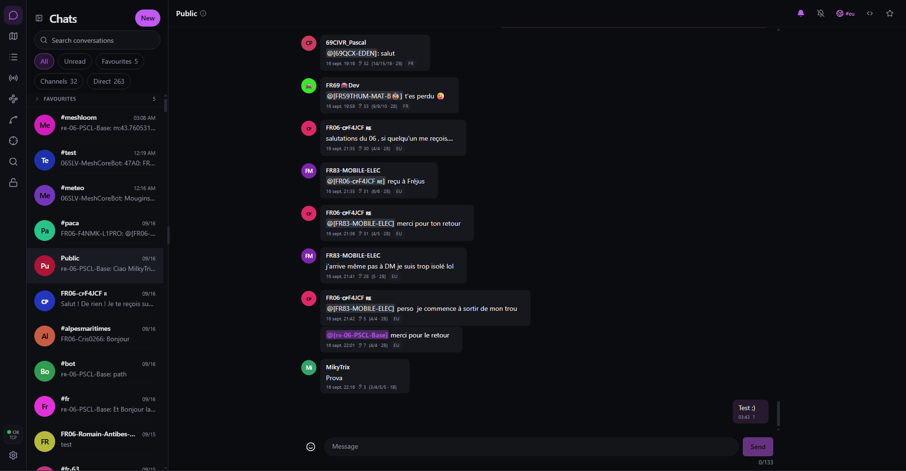

# Meshloom

[](https://github.com/TwinRocket/meshloom/actions/workflows/all-quality.yml)
[](https://github.com/TwinRocket/meshloom/releases)
[](LICENSE.md)

Web interface for a MeshCore companion radio: messages, contacts, and mesh observation in the browser. The server talks to the radio over USB, TCP, or Bluetooth and keeps history beyond the device’s memory.

Fork of [Jack Kingsman’s MeshCore web client](https://github.com/jkingsman/Remote-Terminal-for-MeshCore), via [Ian Langworth](https://github.com/statico/remoteterm-meshcore). Original copyright remains in [LICENSE.md](LICENSE.md).

**Trusted network only.** There are no user accounts, and bots can run arbitrary Python. Optional HTTP Basic auth (`MESHCORE_BASIC_AUTH_USERNAME` / `MESHCORE_BASIC_AUTH_PASSWORD`) is a coarse gate and needs HTTPS. Set `MESHCORE_DISABLE_BOTS=true` to turn bots off.

Meshloom takes over radio contacts and channels. A poor fit if you swap radios and expect the device to keep its own favorites independently of the app.



## Install

On Linux the installer offers a native systemd service or Docker. Radio transport is configured in the web UI after install. Use `bash -c` so prompts still have a terminal — do not pipe into `bash`.

```bash
/bin/bash -c "$(curl -fsSL https://get.meshloom.app)"
```

Then open http://127.0.0.1:8000 and choose the radio under **Settings > Radio**. A new install joins Meshloom Community unless you set `MESHLOOM_COMMUNITY=0`; leave or bind an IATA code under **Settings > Community**. User-facing docs live in [`docs/user/`](docs/user/) and are published at https://meshloom.app/docs/.

From a checkout (development): [CONTRIBUTING.md](CONTRIBUTING.md). Docker image: `ghcr.io/twinrocket/meshloom`. Portainer, HTTPS, systemd, and extra environment variables: [README_ADVANCED.md](README_ADVANCED.md).

### On Home Assistant

Meshloom runs as an add-on. The button opens the dialog on your own instance with
the repository filled in — it is a redirector and learns nothing about you:

[](https://my.home-assistant.io/redirect/supervisor_add_addon_repository/?repository_url=https%3A%2F%2Fgithub.com%2FTwinRocket%2Fmeshloom)

Or add `https://github.com/TwinRocket/meshloom` by hand under **Settings → Add-ons →
Add-on store → ⋮ → Repositories**, then install **Meshloom**.

The web interface arrives in the sidebar; the radio proxy is the only thing
published on the host, and its port is set in the add-on's **Network** panel.
Details: [`meshloom/DOCS.md`](meshloom/DOCS.md).

This is not the same as [publishing to Home Assistant over MQTT](README_HA.md),
which works from any install and needs no add-on.

## Update

```bash
sudo apt upgrade                          # Debian / Ubuntu
sudo dnf upgrade                          # Fedora / Rocky / Alma
sudo docker compose pull && sudo docker compose up -d
```

The database stays in place (`/var/lib/meshloom` for the package, `./data` for Docker). Schema migrations run on startup.

## More

- User docs (source): [`docs/user/`](docs/user/) — published at https://meshloom.app/docs/
- API docs once the server is up: http://127.0.0.1:8000/docs
- Home Assistant — publishing the mesh over MQTT: [README_HA.md](README_HA.md)
- Home Assistant — running Meshloom as an add-on: [`meshloom/DOCS.md`](meshloom/DOCS.md)
